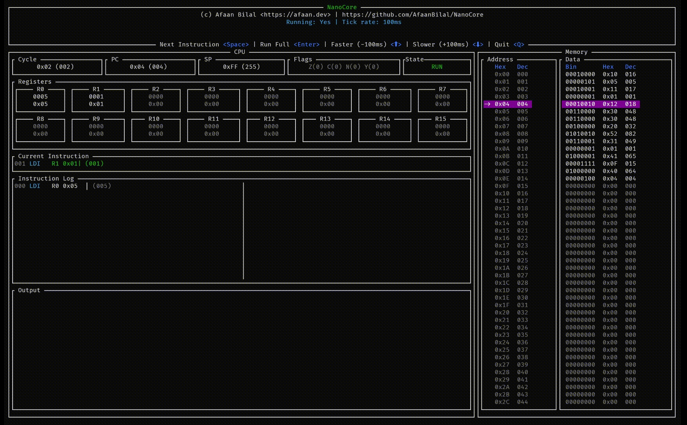

# NanoCore: An 8-bit CPU Emulator

`NanoCore` is a meticulously crafted emulator for a custom 8-bit CPU. Designed with extreme minimalism in mind, this CPU operates within a strict 256-byte memory space, with all registers, the Program Counter (PC), and the Stack Pointer (SP) being 8-bit.

This project serves as an educational exercise in understanding the fundamental principles of computer architecture, low-level instruction set design, memory management under severe constraints, and assembly language programming.

**Website:** [nanocore.afaan.dev](https://nanocore.afaan.dev) &nbsp;|&nbsp; **DeepWiki:** [AfaanBilal/NanoCore](https://deepwiki.com/AfaanBilal/NanoCore)



---

## ✨ Key Features

- **True 8-bit Architecture:** All general-purpose registers (R0–R15), Program Counter (PC), and Stack Pointer (SP) are 8-bit.
- **256-byte Memory:** The entire addressable memory space is limited to 256 bytes (`0x00` to `0xFF`).
- **Variable-Length Instruction Set:** 1-byte, 2-byte, and 3-byte instructions to maximize opcode efficiency within the limited address space.
- **Modular Design:** CPU cycle broken down into distinct Fetch, Decode, and Execute phases.
- **Inbuilt Two-Pass Assembler:** Write NanoCore Assembly (`.nca`) instead of raw machine code.
- **Terminal User Interface:** Fully functional TUI with breakpoints for interactive debugging.
- **Typed Error Handling:** Stack overflow/underflow, division by zero, and invalid operands all surface as structured Rust errors.

---

## 📦 Installation

### Option 1 — Compiled Binaries

Download pre-built binaries for your platform from the [GitHub Releases](https://github.com/AfaanBilal/NanoCore/releases) page.

### Option 2 — cargo install

```bash
cargo install nanocore
```

### Option 3 — Build from Source

Requires Rust (stable).

```bash
git clone https://github.com/AfaanBilal/NanoCore.git
cd NanoCore
cargo build --release
```

---

## 🚀 Usage

### Run a program

```bash
# Run a pre-assembled binary
cargo run -- programs/test.ncb

# Auto-assemble and run a .nca source file
cargo run -- programs/fib.nca

# Print CPU state after each cycle
cargo run -- programs/test.nca -s

# Print each instruction as it executes
cargo run -- programs/test.nca -i
```

### Assemble to binary

```bash
cargo run --bin nca -- -i example.nca -o example.ncb
```

### Launch the TUI debugger

```bash
cargo run --bin tui -- programs/counter.nca
```

### Run the test suite

```bash
cargo test
```

---

## 🧮 Architecture

| Component | Details |
| :--- | :--- |
| Registers | R0–R15, all 8-bit |
| Program Counter | 8-bit (0x00–0xFF) |
| Stack Pointer | 8-bit (stack: 0xEA–0xFF) |
| Flags | Zero (Z), Carry (C), Negative (N) |
| Memory | 256 bytes total |
| Stack size | 22 bytes |
| Max cycles | 1024 per run |

---

## 🧮 Instruction Set Architecture (ISA)

> See `programs/` for example programs and compiled binaries.

NanoCore features a small but complete instruction set across 7 categories.

### Instruction Format

- **1-byte:** Opcode only.
- **2-byte:** Opcode + one 8-bit operand (register or address).
- **3-byte:** Opcode + two 8-bit operands (register + immediate or address).

### Implemented Instructions

| Opcode | Bytes | Mnemonic         | Description                             |
| :----- | ----: | :--------------- | :-------------------------------------- |
| `0x00` |     1 | `HLT`            | Halt execution                          |
| `0x01` |     1 | `NOP`            | No operation                            |
| `0x02` |     3 | `LDI Rd val`     | Load immediate `val` into `Rd`          |
| `0x03` |     3 | `LDA Rd addr`    | Load from memory address into `Rd`      |
| `0x04` |     2 | `LDR Rd Rs`      | Load from address in `Rs` into `Rd`     |
| `0x05` |     2 | `MOV Rd Rs`      | Copy `Rs` into `Rd`                     |
| `0x06` |     3 | `STORE addr Rd`  | Store `Rd` into memory address          |
| `0x07` |     2 | `PUSH Rd`        | Push `Rd` onto stack                    |
| `0x08` |     2 | `POP Rd`         | Pop top of stack into `Rd`              |
| `0x09` |     2 | `ADD Rd Rs`      | `Rd = Rd + Rs`                          |
| `0x0A` |     3 | `ADDI Rd val`    | `Rd = Rd + val`                         |
| `0x0B` |     2 | `SUB Rd Rs`      | `Rd = Rd - Rs`                          |
| `0x0C` |     3 | `SUBI Rd val`    | `Rd = Rd - val`                         |
| `0x0D` |     2 | `INC Rd`         | `Rd = Rd + 1`                           |
| `0x0E` |     2 | `DEC Rd`         | `Rd = Rd - 1`                           |
| `0x0F` |     2 | `AND Rd Rs`      | `Rd = Rd & Rs`                          |
| `0x10` |     2 | `OR Rd Rs`       | `Rd = Rd \| Rs`                         |
| `0x11` |     2 | `XOR Rd Rs`      | `Rd = Rd ^ Rs`                          |
| `0x12` |     2 | `NOT Rd`         | `Rd = ~Rd`                              |
| `0x13` |     2 | `CMP Rd Rs`      | Set flags from `Rd - Rs` (no store)     |
| `0x14` |     2 | `SHL Rd Rs`      | Logical shift left                      |
| `0x15` |     2 | `SHR Rd Rs`      | Logical shift right                     |
| `0x16` |     2 | `JMP addr`       | Unconditional jump                      |
| `0x17` |     2 | `JZ addr`        | Jump if Zero flag set                   |
| `0x18` |     2 | `JNZ addr`       | Jump if Zero flag clear                 |
| `0x19` |     2 | `PRINT Rd`       | Print `Rd` as ASCII character           |
| `0x1A` |     2 | `MUL Rd Rs`      | `Rd = Rd * Rs`                          |
| `0x1B` |     3 | `MULI Rd val`    | `Rd = Rd * val`                         |
| `0x1C` |     2 | `DIV Rd Rs`      | `Rd = Rd / Rs`                          |
| `0x1D` |     3 | `DIVI Rd val`    | `Rd = Rd / val`                         |
| `0x1E` |     2 | `MOD Rd Rs`      | `Rd = Rd mod Rs`                        |
| `0x1F` |     3 | `MODI Rd val`    | `Rd = Rd mod val`                       |
| `0x20` |     2 | `CALL addr`      | Call subroutine (push return address)   |
| `0x21` |     1 | `RET`            | Return from subroutine                  |
| `0x22` |     2 | `ROL Rd Rs`      | Rotate left                             |
| `0x23` |     2 | `ROR Rd Rs`      | Rotate right                            |
| `0x24` |     2 | `IN Rd`          | Read byte from stdin into `Rd`          |
| `0x25` |     2 | `JMPR Rd`        | Jump to address in `Rd`                 |
| `0x26` |     2 | `CALLR Rd`       | Call subroutine at address in `Rd`      |
| `0x27` |     2 | `STR Rd Rs`      | Store `Rd` to address held in `Rs`      |

> All arithmetic is wrapping. `R0 = 0x00`, `R1 = 0x01`, ..., `R15 = 0x0F`.

---

## 🛠️ Assembly Language

NanoCore Assembly (`.nca`) files are plain text. The assembler performs two passes — first to map labels and constants, then to emit bytecode.

### Syntax

```assembly
; Comment
.CONST MAX 10          ; Named constant
.DB 0x01 0x02 0x03     ; Embed raw bytes
.STRING "Hello"        ; Embed ASCII string (null-terminated)

start:                 ; Label
    LDI R0 0
    LDI R1 MAX         ; Use constant
loop:
    ADD R0 R1
    DEC R2
    JNZ loop
    HLT
```

### Directives

| Directive | Description |
| :--- | :--- |
| `.CONST name val` | Define a named constant |
| `.DB byte ...` | Embed raw bytes at current position |
| `.STRING "text"` | Embed a null-terminated ASCII string |

---

## 📂 Code Structure

| File | Description |
| :--- | :--- |
| `src/cpu.rs` | CPU state — registers, PC, SP, memory, flags |
| `src/nanocore.rs` | Main emulator — load, run, cycle, fetch/decode/execute |
| `src/assembler.rs` | Two-pass assembler core |
| `src/lib.rs` | Library exports and `Op` enum (instruction set) |
| `src/error.rs` | Typed error definitions |
| `src/bin/nca.rs` | `nca` assembler binary |
| `src/bin/tui.rs` | `tui` debugger binary entry point |
| `src/tui/` | TUI implementation (ratatui) |
| `programs/` | Example `.nca` source files and `.ncb` binaries |

---

## 📝 Example Program — Fibonacci Sequence

```assembly
; Print the fibonacci sequence (two-digit)
start:
    LDI R0 0
    LDI R1 1
    LDI R2 12
    LDI R12 32
loop:
    JMP print_digits

post_print:
    MOV R3 R1
    ADD R1 R0
    MOV R0 R3
    DEC R2
    JNZ loop
end:
    HLT

print_digits:
    PUSH R10
    PUSH R11
    MOV R10 R0
    DIVI R10 10
    JZ unit_digit
    ADDI R10 48
    PRINT R10
unit_digit:
    MOV R11 R0
    MODI R11 10
    ADDI R11 48
    PRINT R11
print_space:
    PRINT R12
    POP R11
    POP R10
    JMP post_print
```

---

## 🤝 Contributing

All contributions are welcome. Please create an issue first for any feature request or bug. Then fork the repository, create a branch, make your changes, and open a pull request.

---

## 📄 License

**NanoCore** is released under the MIT License. See [LICENSE](LICENSE) for details.
