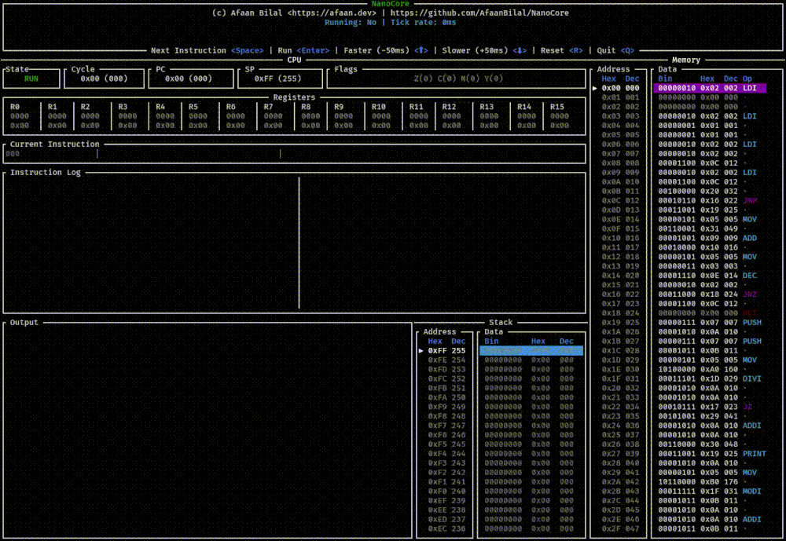

# NanoCore: An 8-bit CPU Emulator

## 🌟 Introduction

`NanoCore` is a meticulously crafted emulator for a custom 8-bit CPU.

Designed with extreme minimalism in mind, this CPU operates within a strict 256-byte memory space, with all registers, the Program Counter (PC), and the Stack Pointer (SP) being 8-bit.

This project serves as an educational exercise in understanding the fundamental principles of computer architecture, low-level instruction set design, memory management under severe constraints, and assembly language programming.



## ✨ Key Features

  * **True 8-bit Architecture:** All general-purpose registers (R0-R15), Program Counter (PC), and Stack Pointer (SP) are 8-bit.
  * **256-byte Memory:** The entire addressable memory space is limited to 256 bytes (`0x00` to `0xFF`), making it a challenge to write highly optimized and compact code.
  * **Variable-Length Instruction Set:** Supports both 1-byte, 2-byte and 3-byte instructions to maximize opcode efficiency and flexibility within the limited address space.
  * **Modular Design:** CPU cycle is broken down into distinct Fetch, Decode, and Execute phases for clarity.
  * **Inbuilt Two-Pass Assembler:** The NanoCore Assembler makes it easier to program it by writing NanoCore Assembly instead of direct machine code.

## 🧮 Instruction Set Architecture (ISA)

> See `programs/` for example programs and compiled binaries.

NanoCore features a small but functional instruction set designed for its 8-bit constraints.

### Instruction Format

  * **1-byte instructions:** One 8-bit opcode.
  * **2-byte instructions:** An 8-bit opcode followed by an 8-bit operand (e.g., an immediate value or an address).
  * **3-byte instructions:** An 8-bit opcode followed by two 8-bit operands (e.g., an immediate value or an address).

### Implemented Instructions

| Opcode | Bytes | Mnemonic       | Description                             | Encoding Example |
| :----- | ----: | :------------- | :-------------------------------------- | :--------------- |
| `0x00` |     1 | `HLT`          | Halts CPU execution                     | `0x00`           |
| `0x01` |     1 | `NOP`          | No operation                            | `0x01`           |
| `0x02` |     3 | `LDI Reg val`  | Load immediate `val` into `Reg`         | `0x02 0x00 0xAB` |
| `0x03` |     3 | `LDA Reg addr` | Load from mem address `addr` into `Reg` | `0x03 0x00 0xCC` |
| `0x04` |     2 | `LDR Rd Rs`    | Load from mem address in `Rs` into `Rd` | `0x04 0x00 0x01` |
| `0x05` |     2 | `MOV Rd Rs`    | Copy value from `Rs` into `Rd`          | `0x05 0x01 0x02` |
| `0x06` |     3 | `STO Reg addr` | Store `Reg` into mem address `addr`     | `0x05 0x01 0xAA` |
| `0x07` |     2 | `PUSH Reg`     | Push `Reg` value into stack.            | `0x05 0x01`      |
| `0x08` |     2 | `POP Reg`      | Pop from stack into `Reg`               | `0x05 0x01`      |
| `0x09` |     2 | `ADD Rd Rs`    | Add value of `Rs` to `Rd`               | `0x05 0x01 0x02` |
| `0x0A` |     3 | `ADDI Reg val` | Add immediate `val` to `Reg`            | `0x05 0x01 0xAB` |
| `0x0B` |     2 | `SUB Rd Rs`    | Subtract value of `Rd` from `Rs`        | `0x05 0x01 0x02` |
| `0x0C` |     3 | `SUBI Reg val` | Subtract immediate `val` from `Reg`     | `0x05 0x01 0xAB` |
| `0x0D` |     2 | `INC Reg`      | Increment `Reg`                         | `0x05 0x01`      |
| `0x0E` |     2 | `DEC Reg`      | Decrement `Reg`                         | `0x05 0x01`      |
| `0x0F` |     2 | `AND Rd Rs`    | Set `Rd` to `Rd & Rs`                   | `0x05 0x01 0x02` |
| `0x10` |     2 | `OR Rd Rs`     | Set `Rd` to `Rd \| Rs`                  | `0x05 0x01 0x02` |
| `0x11` |     2 | `XOR Rd Rs`    | Set `Rd` to `Rd ^ Rs`                   | `0x05 0x01 0x02` |
| `0x12` |     2 | `NOT Reg`      | Set `Reg` to `!Reg`                     | `0x05 0x01`      |
| `0x13` |     2 | `CMP Rd Rs`    | Set `Z` flag if `Rd == Rs`              | `0x05 0x01 0x02` |
| `0x14` |     2 | `SHL Reg`      | Shift left in `Reg` by 1 (`<< 1`)       | `0x05 0x01`      |
| `0x15` |     2 | `SHR Reg`      | Shift right in `Reg` by 1 (`>> 1`)      | `0x05 0x01`      |
| `0x16` |     2 | `JMP addr`     | Unconditional jump to `addr`            | `0x05 0xAA`      |
| `0x17` |     2 | `JZ addr`      | Jump to `addr` if `Z` flag is set       | `0x05 0xAA`      |
| `0x18` |     2 | `JNZ addr`     | Jump to `addr` if `Z` flag is not set   | `0x05 0xAA`      |
| `0x19` |     2 | `PRINT Reg`    | Print `Reg` as an ASCII character       | `0x19 0x01`      |
| `0x1A` |     2 | `MUL Rd Rs`    | Multiply value of `Rs` to `Rd`          | `0x1A 0x01 0x02` |
| `0x1B` |     3 | `MULI Reg val` | Multiply immediate `val` to `Reg`       | `0x1B 0x01 0xAB` |
| `0x1C` |     2 | `DIV Rd Rs`    | Divide value of `Rs` by `Rd`            | `0x1C 0x01 0x02` |
| `0x1D` |     3 | `DIVI Reg val` | Divide `Reg` by immediate `val`         | `0x1D 0x01 0xAB` |
| `0x1E` |     2 | `MOD Rd Rs`    | Modulus value of `Rs` by `Rd`           | `0x1E 0x01 0x02` |
| `0x1F` |     3 | `MODI Reg val` | Modulus `Reg` by immediate `val`        | `0x1F 0x01 0xAB` |

> - `val` = `Immediate value`
> - `addr` = `Memory address`
> - `Reg` = `Register`
> - `Rs` = `Source register`
> - `Rd` = `Destination register`
> - `Z` flag = Zero Flag
> - `R0` = `0x00`, `R1` = `0x01` ..., `R15` = `0x0F`
> - All addition, subtraction, increment and decrement is wrapping.

## 🚀 Getting Started

To run the NanoCore emulator, you'll need to setup Rust locally.

1.  **Clone the repository:**
    ```bash
    git clone https://github.com/AfaanBilal/nanocore.git
    cd nanocore
    ```
2.  **Run the example program:**
    The `programs/test.ncb` file contains a small, assembled program that demonstrates the CPU's basic functionality.
    ```bash
    cargo run -- programs/test.ncb
    ```
    You should see the emulator's debug output and the program's output to your console. The source assembly file is `programs/test.nca`.

## 🛠️ Assembling

To assemble a program (say `example.nca`), run the NanoCore Assembler (`nca`):
```bash
cargo r --bin nca -- -i example.nca -o example.ncb
```
This should assemble the `example.nca` (NanoCore Assembly) to `example.ncb` (NanoCore Binary).

## ⚙️ Running

To run this assembled binary, run:
```bash
cargo r -- example.ncb
```

## 🪄 Assemble and Run

To assemble and run without saving a binary:
```bash
cargo r -- example.nca
```
> Note that the filename MUST end with the `.nca` extension to be considered a NanoCore Assembly file which will be automatically assembled before running.

## 📟 Terminal Interface

To run the TUI visualizer:
```bash
cargo r --bin tui -- programs/counter.nca
```

## 📂 Code Structure

  * `CPU (cpu.rs)`: Defines the CPU's internal state, including registers, program counter, stack pointer, memory, and flag bits.
  * `NanoCore (nanocore.rs)`: The main emulator struct, responsible for loading programs, running cycles, and managing the `CPU`.
      * `NanoCore::new()`: Initializes a fresh computer state.
      * `NanoCore::load_program()`: Places machine code into the simulated memory.
      * `NanoCore::run()`: Executes the CPU cycle loop until halted.
      * `NanoCore::cycle()`: Performs a single CPU cycle (Fetch, Decode, Execute).
      * `NanoCore::fetch_decode()`: Reads the instruction byte(s) from memory and determines its type and operands.
      * `NanoCore::execute_instruction()`: Performs the operation defined by the decoded instruction, updating the CPU state.
  * `Assembler (assembler.rs)`: The NanoCore assembler core.
  * `Assembler bin (bin/nca.rs)`: The NanoCore assembler binary.
  * `TUI bin (bin/tui.rs)`: The NanoCore Terminal UI.

---

## 🤝 Contributing

All contributions are welcome. Please create an issue first for any feature request
or bug. Then fork the repository, create a branch and make any changes to fix the bug
or add the feature and create a pull request. That's it!
Thanks!

---

## 📄 License

**NanoCore** is released under the MIT License.
Check out the full license [here](LICENSE).
